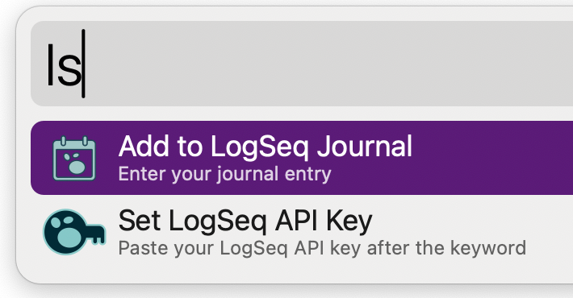

# LogSeq Alfred Workflow

A simple but powerful Alfred workflow to quickly add entries to your daily [LogSeq](https://logseq.com/) journal.

## Features

*   **Quick Add:** Use the `ls` keyword to instantly add a new block to your daily journal page.
*   **Secure:** Your LogSeq API key is stored securely in the macOS Keychain, not in plain text.
*   **Customizable Date Format:** Supports LogSeq's default ordinal date format (e.g., "Sep 6th, 2023") or a custom `strftime` format.

## Installation

1.  Go to the Releases page of this repository.
2.  Download the latest `Logseq.alfredworkflow` file.
3.  Double-click the downloaded file to install it in Alfred.

## Setup

Before using the workflow, you need to configure it with your LogSeq API key.

1.  In LogSeq, go to `Settings` > `Features` and enable the **HTTP API Server**.
2.  Copy your API Authorization Token.
3.  In Alfred, type `ls-setkey `, paste your API key, and press Enter.
    *   Example: `ls-setkey 12345-abcdef-67890`
4.  You will see a notification confirming that the key has been saved.

## Usage

With the workflow installed and configured, simply use the `ls` keyword in Alfred to add an entry.

*   **Keyword:** `ls`
*   **Action:** Type your journal entry after the keyword.
*   **Example:** `ls Finished updating the README for my new project.`

This will append "- Finished updating the README for my new project." as a new block on today's journal page in LogSeq.

## Configuration

You can customize the workflow's behavior by changing its environment variables in Alfred's workflow editor.

*   `api_endpoint`: The address of the LogSeq API server. Defaults to `http://127.0.0.1:12315/api`.
*   `journal_date_format`: Controls the date format used for the journal page name.
    *   `ordinal` (default): Uses LogSeq's default format, e.g., "Sep 6th, 2023".
    *   Any other value is treated as a `strftime` format string, e.g., `%Y-%m-%d` would produce "2023-09-06".

## Build

The `build.sh` script will package the workflow into a compressed `.alfredworkflow` file.  You can add an optional `install` argument to have it automatically `open` it which will prompt you to install/update into Alfred.